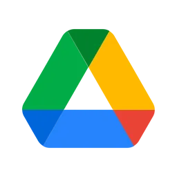

<h1>Hello there, I'm Heidi, your <a href="https://www.linkedin.com/in/heidi-bolivar-349538327/">IT Professional</a>🚀</h1>

<h2>👨‍💻 Information Technology Projects:</h2>

- <b>osTicket (Help Desk Ticketing System)</b>
  - [osTicket: Prerequisites and Installation](https://github.com/HeidiBolivar/osticket-prereqs)
  - [osTicket: Post-Installation Configuration](https://github.com/HeidiBolivar/post-install-config)
  - [osTicket: Creating and Working Tickets](https://github.com/HeidiBolivar/ticket-lifecycle)
- <b>Microsoft Azure</b>
  - [Network Security Groups (NSGs) and Inspecting Network Protocols](https://github.com/HeidiBolivar/azure-network-protocols)
- <b>Active Directory</b>
  - [Active Directory: Preparing Infrastructure in Azure](https://github.com/HeidiBolivar/AD_Preparing_Active_Directory_In_Azure)
  - [Active Directory: Deploying Active Directory in Azure](https://github.com/HeidiBolivar/Active-Directory-Deploying-Active-Directory-in-Azure)
  - [Active Directory: Creating Users, Group Policy, and Managing Accounts in Azure](https://github.com/HeidiBolivar/AD_Creating_Users_Group_Policies_And_Managing_Accounts)

<h2>🤖 AI-Powered Productivity Toolkit Development: Design & Implementation:</h2> 

  - <b> [AI Powered Productivity Toolkit](https://github.com/HeidiBolivar/AI-Powered-Productivity-Toolkit) </b>

<h2>🛠️ Familiarity and proficiency with professional technical tools</h2>

  [][Azure]
  [][AD]
  [][TicketSys]
  [][Notion]
  [][Slack]
  [][Office365]
  [][Excel]
  [][Drive]
  [][Teams]
  [][GAIstudio]
  [][Chatgpt]
  [][Claude]
  
  [][Perplexity]
  [][Presentations.ai]

[Azure]: https://portal.azure.com/#home
[AD]: https://www.quest.com/solutions/active-directory/what-is-active-directory.aspx#:~:text=Active%20Directory%20(AD)%20is%20a,who's%20allowed%20to%20do%20what.
[TicketSys]: https://www.zendesk.com/blog/ticketing-system/
[Office365]: https://www.microsoft365.com/apps?home=1&auth=2
[Excel]: https://www.microsoft365.com/launch/Excel/?home=1
[Notion]: https://www.notion.com
[Drive]: https://drive.google.com/drive/u/0/home
[Meet]: https://meet.google.com/landing?authuser=0
[Teams]: https://www.microsoft.com/en-us/microsoft-teams/group-chat-software
[Slack]: https://slack.com/intl/es-co/
[Chatgpt]: https://chatgpt.com
[GAIstudio]: https://aistudio.google.com/prompts/new_chat
[Perplexity]: https://www.perplexity.ai
[Claude]: https://claude.ai
[Presentations.ai]: https://www.presentations.ai/

# Introduction to Heidi Bolívar

Hello! I'm **Heidi Bolívar**, and I'm currently immersing myself in the exciting world of **Information Technology**. My passion lies in learning new programming languages, gaining hands-on experience through projects, and continuously expanding my knowledge. I thrive in collaborative environments and am always eager to learn from others, sharing insights and contributing to collective success.

## What I'm Learning

- **Technologies**: I'm exploring a variety of programming languages and tools to build a solid foundation in software development and IT.
- **Focus**: Currently honing my skills in software development, problem-solving, and system design to contribute meaningfully to the tech community. 

## Goals and Aspirations

- **Short-term**: Focused on developing my skills through personal projects and contributing to open-source initiatives.
- **Long-term**: Striving to become proficient in multiple programming languages and ultimately pursue a career as a skilled IT professional.

## Connect with Me

I love connecting with like-minded professionals and learning from others. You can follow my progress and updates on ongoing projects here on GitHub. Feel free to reach out!

[LinkedIn Profile](https://www.linkedin.com/in/heidi-bolivar-349538327/) *(Click to connect)*
